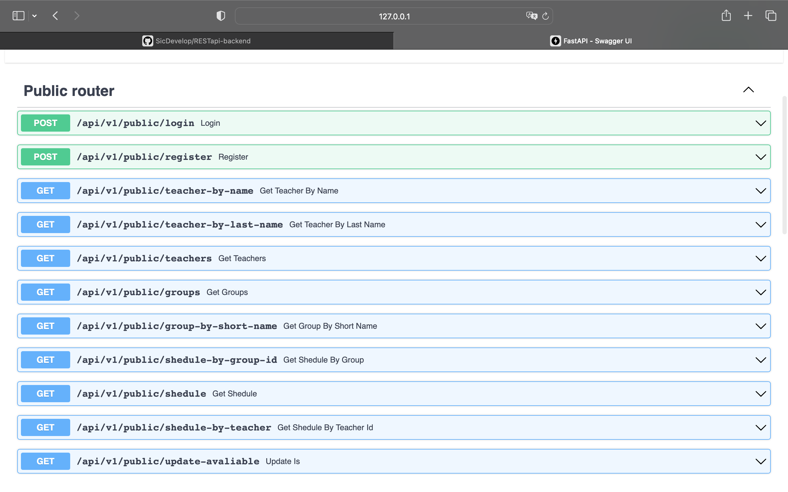

# Kingdom API.

Как Мы уже и говорили ранее, Kingom System, представляет собой некий приватный мост. Оператор может использовать его как хочется, но остальным разрешено только смотреть.

Это к тому, что все защищено от влияния третьих лиц, которым нельзя давать доступ на редактирование данных. Потому оператора имеет полный доступ к редактированию, а ученики - только на просмотр.

Мы используем FastAPI для разработки этого API, потому предоставляем еще и _swagger_-версию, но если вам необходим текстовый формат, то Мы приложим его.

## V1
### Public
- `[POST] /api/v1/public/login` - работает только для оператора. Только он может входить в систему для внесения изменений;
- `[GET]  /api/v1/public/teacher-by-name` - для получения списка учителей по имени;
- `[GET]  /api/v1/public/teachers` - для получения списка всех учителей;
- `[GET]  /api/v1/teacher-by-last-name` - для получения списка учителей по фамилии;
- `[GET]  /api/v1/groups` - для получения всех групп;
- `[GET]  /api/v1/group-by-short-name` - для получения полного имени группы по cокращенному виду;
- `[GET]  /api/v1/shedule-by-group-id` - для получение расписания группы по ID этой группы;
- `[GET]  /api/v1/shedule` - для получения расписания всех групп;
- `[GET]  /api/v1/shedule-by-teacher` - для получения расписания конкретного преподавателя по ID этого преподавателя;
- `[GET]  /api/v1/update-avaliable` - для проверки на то, добавилось ли что-то в расписание.

### Private
- `[POST] /api/v1/admin/add-teacher` - для добавления нового учителя;
- `[POST] /api/v1/admin/edit-teacher` - для изменения учителя по его ID;
- `[POST] /api/v1/admin/delete-teacher` - для удаления учителя по его ID;
- `[POST] /api/v1/admin/add-group` - для добавление группы;
- `[POST] /api/v1/admin/edit-group` - для изменения группы по ее ID;
- `[POST] /api/v1/admin/remove-group` - для удаления группы по ее ID;
- `[POST] /api/v1/admin/add-shedule` - для добавления расписания;
- `[POST] /api/v1/admin/edit-shedule` - для изменения расписания по его ID;
- `[POST] /api/v1/admin/delete-shedule` - для удаления расписания по его ID;

