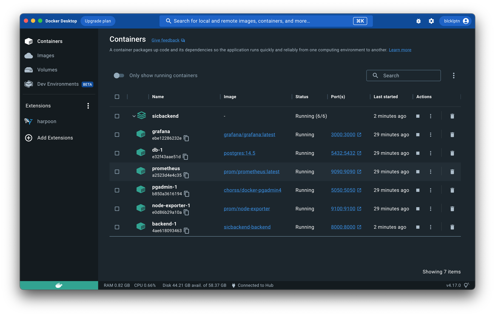

# Kingdom system installation guide.

Установка не занимает много времени, все очень просто. Все что нужно - установить __Docker__.

Серьезно, вам нужен только один инструмент для запуска проекта ( ну и настройка конфигурационных файлов ).

## WSL, Windows, Linux:
```sh
user@system: docker compose --env-file .env up
```

Чтобы убедиться в том, что все сервисы работают, посмотрите статусы контейнеров Docker. Все они должны быть запущены.

