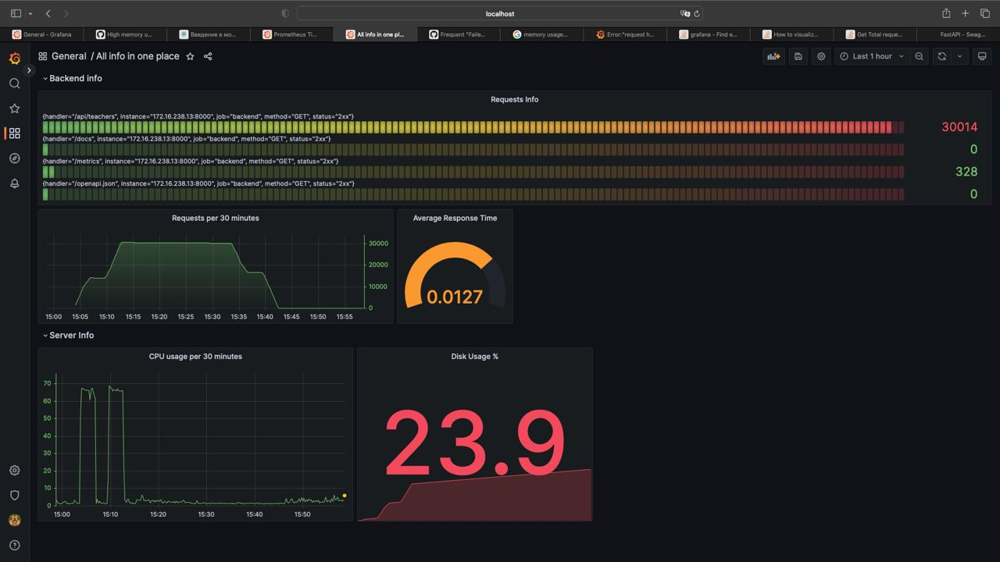

# Kingdom services
Сервисы работают как дополнения к проекту, чтобы упростить работу, запуск, и многих других вещей.

Мы используем такие сервисы как:
- Grafana;
- Prometheus;
- Node exporter;
- PgAdmin

## Grafana
Grafana нужен для того, чтобы техники могли смотреть на состояние сервера, количество запросов и тд. Они в праве сами настраивать то, что хотели бы увидеть, используя _PromQL_ и _node exporter_.

## Prometheus
Этот сервис используется как некое API между приложениями в docker контейнерах. Сейчас оно используется только в _Grafana_, но, возможно, будет использоваться и в других сервисах.

## Node exporter.
Сервис используется для получения данных системы, чтобы техники могли отслеживать их в _Grafana_.

## PgAmin.
Некий Viewer для базы данных. Техники могут смотреть на нее так, как она есть и без красивой обертки.